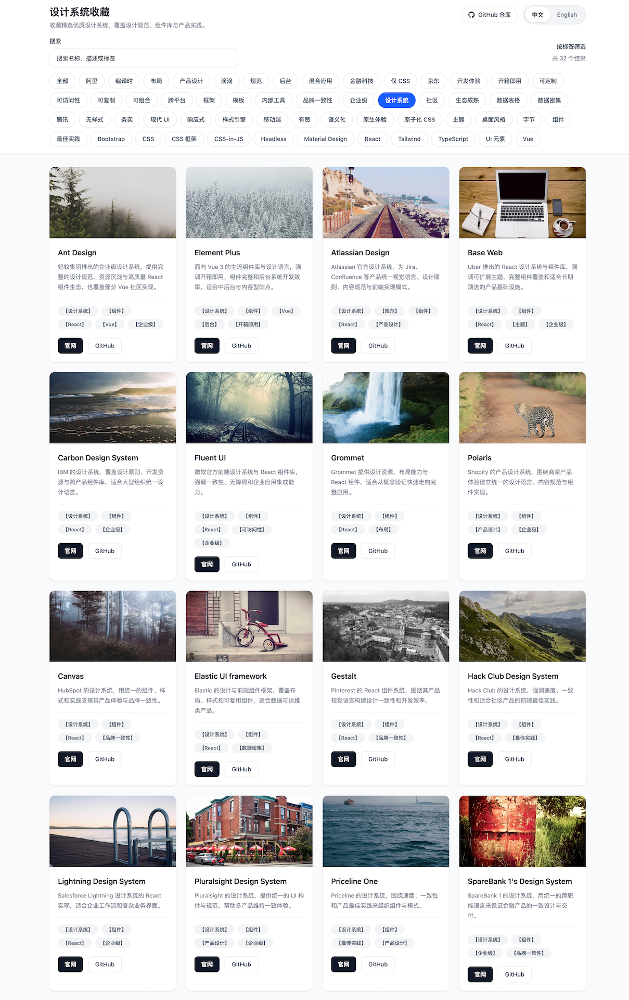

# UI Design System Collection

一个用于收藏优秀设计系统的网站示例，当前支持：

- 页面展示主数据维护在 `src/data/designSystems.json`
- 可通过 `SOURCE.md` 外部来源补充原始设计系统数据，并生成到 `src/data/sourceDesignSystems.json`
- 中英文双语切换
- 官网与 GitHub 地址展示
- 标签化展示，例如 `【组件】`、`【Vue】`、`【React】`
- 移动端搜索、标签筛选与折叠控制

维护方式：

- 本项目后续默认交由 agent 维护，不再依赖 GitHub Actions 定时更新。
- 维护手册见 `AGENT.md`。
- 自动脚本用于辅助抓取和生成，不替代 agent 对主数据的筛选、去重、文案整理与展示判断。

数据维护约定：

- `src/data/designSystems.json` 是人工整理后的主数据，页面和 README 都以它为准。
- `src/data/sourceDesignSystems.json` 是根据 `SOURCE.md` 抓取的原始候选数据，用于补充来源，不会自动全部展示到页面。
- `SOURCE.md` 中的来源既可以是 Markdown 列表，也可以是按章节组织的 Markdown 表格，现有脚本会按支持的结构提取设计系统条目。
- 只有当条目补齐中英文说明、官网、GitHub、图片和标签后，才会从原始来源提升到主数据。
- 如果来源条目缺少可靠 GitHub 地址、与现有条目语义重复，或元数据不足，会先保留在原始来源数据中。

更新 README：

```bash
bun run update:readme
```

根据 `SOURCE.md` 抓取补充来源并生成原始数据：

```bash
bun run update:sources
```



<!-- DESIGN_SYSTEMS:START -->
## Collected Design Systems

### Ant Design

- Website: https://ant.design/
- GitHub: https://github.com/ant-design/ant-design
- 中文说明: 蚂蚁集团推出的企业级设计系统，提供完整的设计规范、资源沉淀与高质量 React 组件生态，也覆盖部分 Vue 社区实现。
- English: An enterprise-oriented design system from Ant Group with comprehensive guidelines, design assets, and a mature React component ecosystem, plus related Vue community implementations.
- Tags: `设计系统 / Design System` `组件 / Components` `React / React` `Vue / Vue` `企业级 / Enterprise`

### Element Plus

- Website: https://element-plus.org/
- GitHub: https://github.com/element-plus/element-plus
- 中文说明: 面向 Vue 3 的主流组件库与设计语言，强调开箱即用、组件完整和后台系统开发效率，适合中后台与内容型站点。
- English: A mainstream Vue 3 component library and design language focused on ready-to-use building blocks, broad component coverage, and productivity for admin and content-heavy products.
- Tags: `设计系统 / Design System` `组件 / Components` `Vue / Vue` `后台 / Admin` `开箱即用 / Ready to Use`

### Atlassian Design

- Website: https://atlassian.design/
- GitHub: https://github.com/atlassian
- 中文说明: Atlassian 官方设计系统，为 Jira、Confluence 等产品统一视觉语言、设计原则、内容规范与前端实现模式。
- English: Atlassian's official design system that aligns visual language, principles, content guidance, and implementation patterns across products like Jira and Confluence.
- Tags: `设计系统 / Design System` `规范 / Guidelines` `组件 / Components` `React / React` `产品设计 / Product Design`

### shadcn/ui

- Website: https://ui.shadcn.com/
- GitHub: https://github.com/shadcn-ui/ui
- 中文说明: 建立在 Radix 与 Tailwind 之上的现代组件集合，强调可复制、可组合、可深度定制，适合快速搭建定制化 React 界面。
- English: A modern component collection built on Radix and Tailwind, optimized for copy-paste workflows, composability, and deep customization in React products.
- Tags: `组件 / Components` `React / React` `Tailwind / Tailwind` `可定制 / Customizable` `现代 UI / Modern UI`

### Base Web

- Website: https://baseweb.design/
- GitHub: https://github.com/uber/baseweb
- 中文说明: Uber 推出的 React 设计系统与组件库，强调可扩展主题、完整组件覆盖和适合长期演进的产品基础设施。
- English: Uber's React design system and component library focused on scalable theming, broad component coverage, and a durable foundation for evolving products.
- Tags: `设计系统 / Design System` `组件 / Components` `React / React` `主题 / Theming` `企业级 / Enterprise`

### Blueprint

- Website: https://blueprintjs.com/
- GitHub: https://github.com/palantir/blueprint
- 中文说明: Palantir 的 React UI 工具包，适合数据密集型桌面风格应用，常用于后台、分析和复杂交互场景。
- English: Palantir's React UI toolkit for data-dense, desktop-style applications, commonly used in admin, analytics, and complex interaction scenarios.
- Tags: `组件 / Components` `React / React` `后台 / Admin` `数据密集 / Data Dense`

### Chakra UI

- Website: https://chakra-ui.com/
- GitHub: https://github.com/chakra-ui/chakra-ui
- 中文说明: 强调可访问性、主题定制和开发体验的 React 组件系统，适合快速构建现代产品界面。
- English: A React component system focused on accessibility, theming, and developer experience for building modern product interfaces quickly.
- Tags: `组件 / Components` `React / React` `可访问性 / Accessibility` `主题 / Theming`

### Carbon Design System

- Website: https://carbondesignsystem.com/
- GitHub: https://github.com/carbon-design-system/carbon
- 中文说明: IBM 的设计系统，覆盖设计原则、开发资源与跨产品组件库，适合大型组织统一设计语言。
- English: IBM's design system spanning principles, development resources, and shared components for large organizations with a unified design language.
- Tags: `设计系统 / Design System` `组件 / Components` `React / React` `企业级 / Enterprise`

### Fluent UI

- Website: https://react.fluentui.dev/
- GitHub: https://github.com/microsoft/fluentui
- 中文说明: 微软官方前端设计系统与 React 组件库，强调一致性、无障碍和企业应用集成能力。
- English: Microsoft's official frontend design system and React component library emphasizing consistency, accessibility, and enterprise-ready integration.
- Tags: `设计系统 / Design System` `组件 / Components` `React / React` `可访问性 / Accessibility` `企业级 / Enterprise`

### Grommet

- Website: https://grommet.io/
- GitHub: https://github.com/grommet/grommet
- 中文说明: Grommet 提供设计资源、布局能力与 React 组件，适合从概念验证快速走向完整应用。
- English: Grommet combines design resources, layout primitives, and React components to help teams move from concept to full applications.
- Tags: `设计系统 / Design System` `组件 / Components` `React / React` `布局 / Layout`

### Material UI

- Website: https://mui.com/
- GitHub: https://github.com/mui/material-ui
- 中文说明: 基于 Material Design 的 React 组件库与设计体系，生态成熟，适合快速搭建通用型 Web 应用。
- English: A mature React component library and design system based on Material Design, well suited for building general-purpose web applications quickly.
- Tags: `组件 / Components` `React / React` `Material Design / Material Design` `生态成熟 / Mature Ecosystem`

### Polaris

- Website: https://polaris.shopify.com/
- GitHub: https://github.com/Shopify/polaris
- 中文说明: Shopify 的产品设计系统，围绕商家产品体验建立统一的设计语言、内容规范与组件实现。
- English: Shopify's product design system built to unify design language, content guidance, and component implementation across merchant-facing experiences.
- Tags: `设计系统 / Design System` `组件 / Components` `产品设计 / Product Design` `企业级 / Enterprise`

### Canvas

- Website: https://canvas.hubspot.com/
- GitHub: https://github.com/HubSpot/canvas
- 中文说明: HubSpot 的设计系统，用统一的组件、样式和实践支撑其产品体验与品牌一致性。
- English: HubSpot's design system that supports product consistency with shared components, styles, and implementation practices.
- Tags: `设计系统 / Design System` `组件 / Components` `React / React` `品牌一致性 / Brand Consistency`

### cf-ui

- Website: https://cloudflare.github.io/cf-ui/
- GitHub: https://github.com/cloudflare/cf-ui
- 中文说明: Cloudflare 使用的一组 React UI 包，适合构建统一的内部产品和运维界面。
- English: A set of React UI packages used at Cloudflare to build consistent internal products and operational interfaces.
- Tags: `组件 / Components` `React / React` `后台 / Admin` `内部工具 / Internal Tools`

### Elastic UI framework

- Website: https://elastic.github.io/eui/#/
- GitHub: https://github.com/elastic/eui
- 中文说明: Elastic 的设计与前端组件框架，覆盖布局、样式和可复用组件，适合数据与运维类产品。
- English: Elastic's design and frontend component framework covering layouts, styling, and reusable UI for data-heavy and operational products.
- Tags: `设计系统 / Design System` `组件 / Components` `React / React` `数据密集 / Data Dense`

### Evergreen

- Website: https://evergreen.segment.com/get-started/introduction
- GitHub: https://github.com/segmentio/evergreen
- 中文说明: Segment 推出的务实型 React UI 套件，强调稳定迭代、清晰模式和产品长期演进能力。
- English: Segment's pragmatic React UI kit focused on stable iteration, clear patterns, and long-term product evolution.
- Tags: `组件 / Components` `React / React` `产品设计 / Product Design` `务实 / Pragmatic`

### Gestalt

- Website: https://pinterest.github.io/gestalt/
- GitHub: https://github.com/pinterest/gestalt
- 中文说明: Pinterest 的 React 组件系统，围绕其产品视觉语言构建设计一致性和开发效率。
- English: Pinterest's React component system built to express its product design language with consistency and developer efficiency.
- Tags: `设计系统 / Design System` `组件 / Components` `React / React` `品牌一致性 / Brand Consistency`

### Hack Club Design System

- Website: https://design.hackclub.com
- GitHub: https://github.com/hackclub/design-system
- 中文说明: Hack Club 的设计系统，强调速度、一致性和适合社区产品的前端最佳实践。
- English: Hack Club's design system focused on speed, consistency, and frontend best practices for community-driven products.
- Tags: `设计系统 / Design System` `组件 / Components` `React / React` `最佳实践 / Best Practices`

### Lightning Design System

- Website: https://react.lightningdesignsystem.com/
- GitHub: https://github.com/salesforce/design-system-react
- 中文说明: Salesforce Lightning 设计系统的 React 实现，适合企业工作流和复杂业务界面。
- English: A React implementation of Salesforce Lightning Design System for enterprise workflows and complex business interfaces.
- Tags: `设计系统 / Design System` `组件 / Components` `React / React` `企业级 / Enterprise`

### Pivotal UI

- Website: https://styleguide.pivotal.io/
- GitHub: https://github.com/pivotal-cf/pivotal-ui
- 中文说明: Pivotal 品牌风格下的一组 React 组件，适合统一企业产品的视觉与交互表达。
- English: A set of React components styled for the Pivotal brand, useful for unifying visual and interaction patterns across enterprise products.
- Tags: `组件 / Components` `React / React` `品牌一致性 / Brand Consistency` `企业级 / Enterprise`

### Pluralsight Design System

- Website: https://design-system.pluralsight.com/
- GitHub: https://github.com/pluralsight/design-system
- 中文说明: Pluralsight 的设计系统，提供统一的 UI 构件与规范，帮助多产品维持一致体验。
- English: Pluralsight's design system providing shared UI building blocks and guidelines to keep product experiences consistent.
- Tags: `设计系统 / Design System` `组件 / Components` `产品设计 / Product Design` `企业级 / Enterprise`

### Priceline One

- Website: https://pricelinelabs.github.io/design-system/
- GitHub: https://github.com/pricelinelabs/design-system
- 中文说明: Priceline 的设计系统，围绕速度、一致性和产品最佳实践来组织组件与模式。
- English: Priceline's design system centered on speed, consistency, and product best practices across shared components and patterns.
- Tags: `设计系统 / Design System` `组件 / Components` `最佳实践 / Best Practices` `产品设计 / Product Design`

### React-bootstrap

- Website: https://react-bootstrap.github.io/
- GitHub: https://github.com/react-bootstrap/react-bootstrap
- 中文说明: 将 Bootstrap 体验重构为 React 组件体系，适合快速搭建传统 Web 应用与后台页面。
- English: A React-native rebuild of Bootstrap that helps teams quickly ship traditional web applications and admin experiences.
- Tags: `组件 / Components` `React / React` `Bootstrap / Bootstrap` `开箱即用 / Ready to Use`

### react-desktop

- Website: http://reactdesktop.js.org/
- GitHub: https://github.com/gabrielbull/react-desktop
- 中文说明: 面向 Web 的桌面风格 React 组件库，模拟 macOS 和 Windows 的原生桌面体验。
- English: A desktop-style React component library for the web that recreates native macOS and Windows interface patterns.
- Tags: `组件 / Components` `React / React` `桌面风格 / Desktop Style` `原生体验 / Native-like`

### React SuiteJS

- Website: https://rsuitejs.com/en/
- GitHub: https://github.com/rsuite/rsuite
- 中文说明: RSuite 提供完整的 React 组件集、友好的开发体验和适合业务系统的设计模式。
- English: RSuite offers a broad React component suite, a friendly developer experience, and patterns suited to business applications.
- Tags: `组件 / Components` `React / React` `后台 / Admin` `开发体验 / Developer Experience`

### RebaseJS

- Website: https://rebassjs.org/
- GitHub: https://github.com/rebassjs/rebass
- 中文说明: 基于 Styled System 的 React UI 组件集合，强调主题化、组合性与一致的样式约束。
- English: A set of React UI components built with Styled System, emphasizing theming, composability, and consistent styling constraints.
- Tags: `组件 / Components` `React / React` `主题 / Theming` `可组合 / Composable`

### Seek Style Guide

- Website: https://seek-oss.github.io/seek-style-guide/
- GitHub: https://github.com/seek-oss/seek-style-guide
- 中文说明: SEEK 的在线风格指南与 React 组件体系，用于在多产品环境中维持统一体验。
- English: SEEK's living style guide and React component system for maintaining consistency across multiple product surfaces.
- Tags: `规范 / Guidelines` `组件 / Components` `React / React` `品牌一致性 / Brand Consistency`

### Semantic-UI-React

- Website: https://react.semantic-ui.com/
- GitHub: https://github.com/Semantic-Org/Semantic-UI-React
- 中文说明: Semantic UI 的官方 React 集成，适合以语义化组件方式快速构建传统业务界面。
- English: The official React integration for Semantic UI, suitable for rapidly building traditional business interfaces with semantic components.
- Tags: `组件 / Components` `React / React` `语义化 / Semantic` `开箱即用 / Ready to Use`

### SpareBank 1's Design System

- Website: https://design.sparebank1.no/
- GitHub: https://github.com/SpareBank1/designsystem
- 中文说明: SpareBank 1 的设计系统，用统一的跨职能语言来保证金融产品的一致设计与交付。
- English: SpareBank 1's design system creates a shared cross-disciplinary language for delivering consistent financial product experiences.
- Tags: `设计系统 / Design System` `组件 / Components` `企业级 / Enterprise` `品牌一致性 / Brand Consistency`

### Spark Design System

- Website: https://sparkdesignsystem.com/
- GitHub: https://github.com/sparkdesignsystem/spark-design-system
- 中文说明: Spark 是面向金融科技产品的设计系统，提供模式与组件以支持统一的产品界面。
- English: Spark is a design system for fintech products, providing patterns and components for a unified product interface.
- Tags: `设计系统 / Design System` `组件 / Components` `金融科技 / Fintech` `产品设计 / Product Design`

### Theme UI

- Website: https://theme-ui.com/
- GitHub: https://github.com/system-ui/theme-ui
- 中文说明: Theme UI 基于约束式设计原则构建可主题化的 React 应用，适合设计系统驱动开发。
- English: Theme UI helps teams build themeable React applications based on constraint-driven design principles.
- Tags: `组件 / Components` `React / React` `主题 / Theming` `可定制 / Customizable`

### Headless UI

- Website: https://headlessui.com/
- GitHub: https://github.com/tailwindlabs/headlessui
- 中文说明: Tailwind Labs 推出的无样式可访问组件原语，支持 React 和 Vue，适合构建设计系统底座。
- English: Tailwind Labs' unstyled, accessible component primitives for React and Vue, well suited as a foundation for design systems.
- Tags: `设计系统 / Design System` `无样式 / Unstyled` `可访问性 / Accessibility` `React / React` `Vue / Vue`

### Radix UI

- Website: https://www.radix-ui.com/
- GitHub: https://github.com/radix-ui/primitives
- 中文说明: 面向高质量设计系统的无样式可访问组件原语，强调可组合性、稳定性与开放性。
- English: Unstyled, accessible component primitives for high-quality design systems, focused on composability, stability, and openness.
- Tags: `设计系统 / Design System` `无样式 / Unstyled` `可访问性 / Accessibility` `React / React` `可组合 / Composable`

### CoreUI

- Website: https://coreui.io/
- GitHub: https://github.com/coreui/coreui-react
- 中文说明: CoreUI 提供面向后台和仪表盘场景的 UI 组件与模板，覆盖 Bootstrap、React、Angular 和 Vue 生态。
- English: CoreUI provides UI components and templates for admin and dashboard products across Bootstrap, React, Angular, and Vue.
- Tags: `设计系统 / Design System` `组件 / Components` `后台 / Admin` `React / React` `模板 / Templates`

### Radix Vue

- Website: https://www.radix-vue.com/
- GitHub: https://github.com/unovue/radix-vue
- 中文说明: Radix UI 在 Vue 生态中的实现，提供无样式、可访问的组件原语，适合搭建设计系统和复杂应用。
- English: A Vue implementation inspired by Radix UI, providing unstyled and accessible primitives for design systems and complex applications.
- Tags: `设计系统 / Design System` `无样式 / Unstyled` `可访问性 / Accessibility` `Vue / Vue` `可组合 / Composable`

### Naive UI

- Website: https://www.naiveui.com/
- GitHub: https://github.com/tusen-ai/naive-ui
- 中文说明: 一个 Vue 3 组件库，比较完整，主题可调，使用 TypeScript，支持 tree shaking，适合中后台开发。
- English: A complete Vue 3 component library with customizable themes, TypeScript support, and tree shaking, ideal for middle and backend development.
- Tags: `组件 / Components` `Vue / Vue` `TypeScript / TypeScript` `中后台 / Admin`

### Vuetify

- Website: https://vuetifyjs.com/
- GitHub: https://github.com/vuetifyjs/vuetify
- 中文说明: 基于 Material Design 的 Vue 组件框架，提供大量精心设计的组件和强大的主题系统。
- English: Material Design component framework for Vue, providing many beautifully designed components and a powerful theming system.
- Tags: `设计系统 / Design System` `组件 / Components` `Vue / Vue` `Material Design / Material Design`

### Quasar

- Website: https://quasar.dev/
- GitHub: https://github.com/quasarframework/quasar
- 中文说明: Vue 驱动的全栈框架，一次编写同时构建网站、PWA、移动应用和 Electron 应用。
- English: Vue-driven full-stack framework for building websites, PWAs, mobile apps, and Electron apps with a single codebase.
- Tags: `设计系统 / Design System` `组件 / Components` `Vue / Vue` `跨平台 / Cross-Platform`

### PrimeVue

- Website: https://primevue.org/
- GitHub: https://github.com/primefaces/primevue
- 中文说明: PrimeTek 推出的 Vue UI 组件库，包含丰富的组件集和强大的主题支持。
- English: PrimeTek's Vue UI component library featuring a rich set of components and powerful theme support.
- Tags: `组件 / Components` `Vue / Vue` `可定制 / Customizable`

### Arco Design Vue

- Website: https://arco.design/
- GitHub: https://github.com/arco-design/arco-design-vue
- 中文说明: 字节跳动出品的企业级设计系统 Vue 版，帮助设计师和开发者更快更好地搭建产品。
- English: Enterprise design system by ByteDance for Vue, helping designers and developers build products faster and better.
- Tags: `设计系统 / Design System` `组件 / Components` `Vue / Vue` `企业级 / Enterprise` `字节 / ByteDance`

### TDesign Vue

- Website: https://tdesign.tencent.com/
- GitHub: https://github.com/Tencent/tdesign-vue
- 中文说明: 腾讯出品的企业级设计系统 Vue 版，一致性、模块化、开箱即用的移动端和桌面端组件库。
- English: Enterprise design system by Tencent for Vue, providing consistent, modular, ready-to-use components for mobile and desktop.
- Tags: `设计系统 / Design System` `组件 / Components` `Vue / Vue` `企业级 / Enterprise` `腾讯 / Tencent`

### Varlet

- Website: https://varlet.gitee.io/
- GitHub: https://github.com/varletjs/varlet
- 中文说明: 基于 Vue 3 的移动端组件库，提供全面的移动组件解决方案。
- English: Mobile component library based on Vue 3, providing a comprehensive solution for mobile components.
- Tags: `组件 / Components` `Vue / Vue` `移动端 / Mobile`

### Vant

- Website: https://vant-ui.github.io/vant/
- GitHub: https://github.com/vant-ui/vant
- 中文说明: 有赞出品的轻量、可定制的移动端 Vue 组件库，开箱即用，助力快速开发移动端应用。
- English: Lightweight, customizable mobile Vue component library by Youzan, ready-to-use for rapid mobile development.
- Tags: `组件 / Components` `Vue / Vue` `移动端 / Mobile` `开箱即用 / Ready to Use`

### NutUI

- Website: https://nutui.jd.com/
- GitHub: https://github.com/jdf2e/nutui
- 中文说明: 京东出品的移动端 Vue 组件库，帮助开发者快速搭建移动端应用。
- English: Mobile Vue component library by JD.com, helping developers quickly build mobile applications.
- Tags: `组件 / Components` `Vue / Vue` `移动端 / Mobile` `京东 / JD.com`

### PrimeReact

- Website: https://primereact.org/
- GitHub: https://github.com/primefaces/primereact
- 中文说明: PrimeTek 推出的 React UI 组件库，提供丰富的组件和主题支持。
- English: PrimeTek's React UI component library offering rich components and theme support.
- Tags: `组件 / Components` `React / React` `可定制 / Customizable`

### Arco Design React

- Website: https://arco.design/
- GitHub: https://github.com/arco-design/arco-design
- 中文说明: 字节跳动出品的企业级设计系统 React 版，帮助设计师和开发者更快更好地搭建产品。
- English: Enterprise design system by ByteDance for React, helping designers and developers build products faster and better.
- Tags: `设计系统 / Design System` `组件 / Components` `React / React` `企业级 / Enterprise` `字节 / ByteDance`

### TDesign React

- Website: https://tdesign.tencent.com/
- GitHub: https://github.com/Tencent/tdesign-react
- 中文说明: 腾讯出品的企业级设计系统 React 版，一致性、模块化、开箱即用的移动端和桌面端组件库。
- English: Enterprise design system by Tencent for React, providing consistent, modular, ready-to-use components for mobile and desktop.
- Tags: `设计系统 / Design System` `组件 / Components` `React / React` `企业级 / Enterprise` `腾讯 / Tencent`

### Mantine

- Website: https://mantine.dev/
- GitHub: https://github.com/mantinedev/mantine
- 中文说明:  fully featured React 组件库，专注于用户体验和开发体验，内置许多高级功能。
- English: Fully-featured React component library focused on great user and developer experience with many built-in advanced features.
- Tags: `组件 / Components` `React / React` `可定制 / Customizable` `TypeScript / TypeScript`

### TanStack UI

- Website: https://tanstack.com/
- GitHub: https://github.com/TanStack
- 中文说明: TanStack 生态中的无头组件集合，为数据网格、表格等提供高质量的原语。
- English: Collection of headless components from the TanStack ecosystem, providing high-quality primitives for data grids and tables.
- Tags: `无样式 / Unstyled` `Headless / Headless` `数据表格 / Data Table`

### DaisyUI

- Website: https://daisyui.com/
- GitHub: https://github.com/saadeghi/daisyui
- 中文说明: 基于 Tailwind CSS 的组件库，提供一系列可重用的组件类，直接在 HTML 中使用。
- English: Component library built on Tailwind CSS, providing a set of reusable component classes that you can use directly in your HTML.
- Tags: `组件 / Components` `Tailwind / Tailwind` `CSS / CSS`

### Tailwind CSS

- Website: https://tailwindcss.com/
- GitHub: https://github.com/tailwindlabs/tailwindcss
- 中文说明: 功能类优先的 CSS 框架，直接在 HTML 中快速构建自定义界面，无需离开 HTML 编写 CSS。
- English: Utility-first CSS framework for rapidly building custom user interfaces directly in HTML without writing custom CSS.
- Tags: `原子化 CSS / Utility-First` `CSS 框架 / CSS Framework` `可定制 / Customizable`

### Bootstrap

- Website: https://getbootstrap.com/
- GitHub: https://github.com/twbs/bootstrap
- 中文说明: 全球最流行的 HTML、CSS 和 JS 框架，用于开发响应式布局、移动设备优先的 Web 项目。
- English: The world's most popular HTML, CSS, and JavaScript framework for developing responsive, mobile-first projects on the web.
- Tags: `CSS 框架 / CSS Framework` `响应式 / Responsive` `开箱即用 / Ready to Use`

### Bulma

- Website: https://bulma.io/
- GitHub: https://github.com/jgthms/bulma
- 中文说明: 免费开源的现代 CSS 框架，基于 Flexbox，100% 响应式，仅 CSS 无 JavaScript。
- English: Free, open source modern CSS framework based on Flexbox, 100% responsive, CSS only with no JavaScript.
- Tags: `CSS 框架 / CSS Framework` `响应式 / Responsive` `仅 CSS / CSS Only`

### Tailwind UI

- Website: https://tailwindui.com/
- GitHub: https://github.com/tailwindlabs
- 中文说明: Tailwind CSS 官方推出的组件库，提供精美的生产就绪组件供开发者使用。
- English: Official component library from Tailwind CSS, providing beautiful, production-ready components for developers.
- Tags: `组件 / Components` `Tailwind / Tailwind` `设计系统 / Design System`

### Flowbite

- Website: https://flowbite.com/
- GitHub: https://github.com/themesberg/flowbite
- 中文说明: 基于 Tailwind CSS 的开源 UI 组件库，提供响应式组件和交互式元素。
- English: Open-source UI component library built on Tailwind CSS, providing responsive components and interactive elements.
- Tags: `组件 / Components` `Tailwind / Tailwind` `响应式 / Responsive`

### Uiverse

- Website: https://uiverse.io/
- GitHub: https://github.com/rossanodan/uiverse
- 中文说明: 社区驱动的开源 UI 元素集合，提供大量可复制粘贴的代码片段。
- English: Community-driven collection of open-source UI elements, providing many copy-paste ready code snippets.
- Tags: `UI 元素 / UI Elements` `社区 / Community` `可复制 / Copy-Paste`

### Panda CSS

- Website: https://panda-css.com/
- GitHub: https://github.com/chakra-ui/panda
- 中文说明: 编译时 CSS-in-JS，针对组件开发优化，提供出色的开发体验。
- English: Compile-time CSS-in-JS optimized for component development, delivering great developer experience.
- Tags: `CSS-in-JS / CSS-in-JS` `样式引擎 / Styling Engine` `编译时 / Compile-Time`

### Semi Design

- Website: https://semi.design/
- GitHub: https://github.com/DouyinFE/semi-design
- 中文说明: 字节跳动出品的现代化设计系统，帮助团队高效搭建高质量产品界面。
- English: Modern design system by ByteDance, helping teams build high-quality product interfaces efficiently.
- Tags: `设计系统 / Design System` `组件 / Components` `React / React` `企业级 / Enterprise` `字节 / ByteDance`

### Fusion Design

- Website: https://fusion.design/
- GitHub: https://github.com/alibaba-fusion
- 中文说明: 阿里巴巴推出的企业级设计系统，致力于让设计成为驱动业务增长的引擎。
- English: Enterprise design system from Alibaba, dedicated to making design an engine for driving business growth.
- Tags: `设计系统 / Design System` `React / React` `企业级 / Enterprise` `阿里 / Alibaba`

### JD Design

- Website: https://design.jd.com/
- GitHub: https://github.com/jdf2e
- 中文说明: 京东官方设计系统，为京东产品提供统一的设计语言和组件实现。
- English: Official design system from JD.com, providing unified design language and component implementations for JD products.
- Tags: `设计系统 / Design System` `企业级 / Enterprise` `京东 / JD.com`

### Zan Design

- Website: https://design.youzan.com/
- GitHub: https://github.com/youzan
- 中文说明: 有赞官方设计系统，支撑有赞全系列产品的设计一致性和开发效率。
- English: Official design system from Youzan, supporting design consistency and development efficiency across Youzan product lines.
- Tags: `设计系统 / Design System` `企业级 / Enterprise` `有赞 / Youzan`

### Cube UI

- Website: https://didi.github.io/cube-ui/
- GitHub: https://github.com/didi/cube-ui
- 中文说明: 滴滴前端团队维护的基于 Vue 的移动端 UI 组件库，用于快速开发移动端应用。
- English: Mobile UI component library based on Vue maintained by Didi frontend team, for rapid mobile application development.
- Tags: `组件 / Components` `Vue / Vue` `移动端 / Mobile` `滴滴 / Didi`

### Vuesax

- Website: https://vuesax.com/
- GitHub: https://github.com/lusaxweb/vuesax
- 中文说明: Vue 组件库，具有新颖的设计和大量可定制的组件。
- English: Vue component library with fresh design and a large collection of customizable components.
- Tags: `组件 / Components` `Vue / Vue` `可定制 / Customizable`

### Framework7

- Website: https://framework7.io/
- GitHub: https://github.com/framework7io/framework7
- 中文说明: 全功能 HTML 应用框架，用于构建混合移动应用，带有原生 iOS 和 Material Design 外观。
- English: Full-featured HTML application framework for building hybrid mobile apps with native iOS and Material Design look and feel.
- Tags: `框架 / Framework` `移动端 / Mobile` `混合应用 / Hybrid App`

### ProComponents

- Website: https://procomponents.ant.design/
- GitHub: https://github.com/ant-design/pro-components
- 中文说明: Ant Design 官方配套的中后台模板/组件库，提供了开箱即用的模板和业务组件。
- English: Official admin/backend template/component library paired with Ant Design, providing ready-to-use templates and business components.
- Tags: `组件 / Components` `React / React` `中后台 / Admin` `开箱即用 / Ready to Use`

### Naive UI Pro

- Website: https://www.naiveui.com/zh-CN/os-theme/docs/naive-ui-pro-introduction
- GitHub: https://github.com/tusen-ai/naive-ui-pro
- 中文说明: Naive UI 配套的中后台解决方案，提供模板和业务组件帮助快速搭建中后台应用。
- English: Admin/backend solution paired with Naive UI, providing templates and business components for rapid admin application development.
- Tags: `组件 / Components` `Vue / Vue` `中后台 / Admin`

### Element Pro

- Website: https://pro.element-plus.org/
- GitHub: https://github.com/element-plus/element-plus-pro
- 中文说明: Element Plus 配套的中后台解决方案，帮助开发者快速搭建企业级中后台项目。
- English: Admin/backend solution paired with Element Plus, helping developers quickly build enterprise-level admin projects.
- Tags: `组件 / Components` `Vue / Vue` `中后台 / Admin` `企业级 / Enterprise`
<!-- DESIGN_SYSTEMS:END -->
